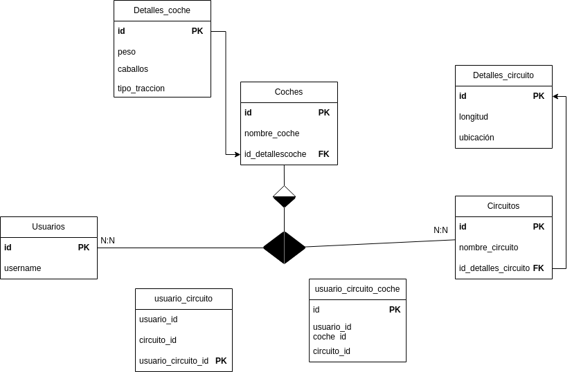

# Proyecto Leaderboard - Laravel API

## 📌 Supuesto Práctico: Sistema de Leaderboard para un Videojuego de Carreras

En IG Formación, para realziar un torneo por el final de curso, se ha solicitado el desarrollo de un **sistema de leaderboard** para un videojuego de carreras. El objetivo principal es gestionar los tiempos de vuelta de los jugadores en diferentes circuitos, permitiendo así un **ranking dinámico y actualizado** de los mejores pilotos en cada pista y con cada vehículo.

En este primer prototipo, se debe permitir que los usuarios se registren para realizar el torneo, donde serán asociados a un circuito específico y al coche utilizado.

Para esto, se han modelado las siguientes entidades:
- **Usuarios**: Representa a los jugadores, con datos como nombre y email.
- **Coches**: Vehículos utilizados en las carreras, con sus detalles técnicos (peso, caballos, tracción).
- **Circuitos**: Pistas donde se corren las vueltas, con información de ubicación y longitud.

Este sistema proporciona una plataforma para que los jugadores compitan de manera justa y transparente, promoviendo el análisis de datos y la mejora continua de su rendimiento en cada circuito. 

## 🖼️ Esquema de la Base de Datos
A continuación, se muestra la estructura de la base de datos utilizada en este proyecto:



### 🚀 Pasos para Levantar la Aplicación

### 1️⃣ **Clonar el Repositorio**
```bash
git clone https://github.com/userdegithub/leaderboard-laravel.git
cd leaderboard-laravel
```

### 2️⃣ **Instalar PHP y Composer**
Si no tienes PHP y Composer instalados:
```bash
sudo apt update && sudo apt install php php-cli unzip curl
curl -sS https://getcomposer.org/installer | php
sudo mv composer.phar /usr/local/bin/composer
```
Verifica la instalación:
```bash
php -v
composer -v
```

### 3️⃣ **Instalar las Dependencias del Proyecto**
Ejecuta el siguiente comando para instalar las dependencias de Laravel:
```bash
composer install
```

### 4️⃣ **Configurar el Archivo `.env`**
Copia el archivo de configuración y edítalo con los valores correctos:
```bash
cp .env.example .env
```
Asegúrate de configurar los valores de la base de datos en el archivo `.env`:
```
DB_CONNECTION=mariadb
DB_HOST=127.0.0.1
DB_PORT=3306
DB_DATABASE=leaderboard
DB_USERNAME=root
DB_PASSWORD=m1_s3cr3t
```

### 5️⃣ **Levantar el Contenedor de Base de Datos con Docker**
Si usas Docker, ejecuta:
```bash
docker-compose up -d
```

### 6️⃣ **Generar la Clave de la Aplicación**
```bash
php artisan key:generate
```

### 7️⃣ **Ejecutar Migraciones y Seeders**
Este comando creará la estructura de la base de datos y llenará las tablas con datos de prueba:
```bash
php artisan migrate:fresh --seed
```

### 8️⃣ **Levantar el Servidor de Desarrollo**
```bash
php artisan serve
```
Esto ejecutará el servidor en `http://127.0.0.1:8000`.

### 9️⃣ **Probar la API con Postman**

---
✅ **Siguiendo estos pasos, la aplicación estará lista para su uso y desarrollo.** 🚀

